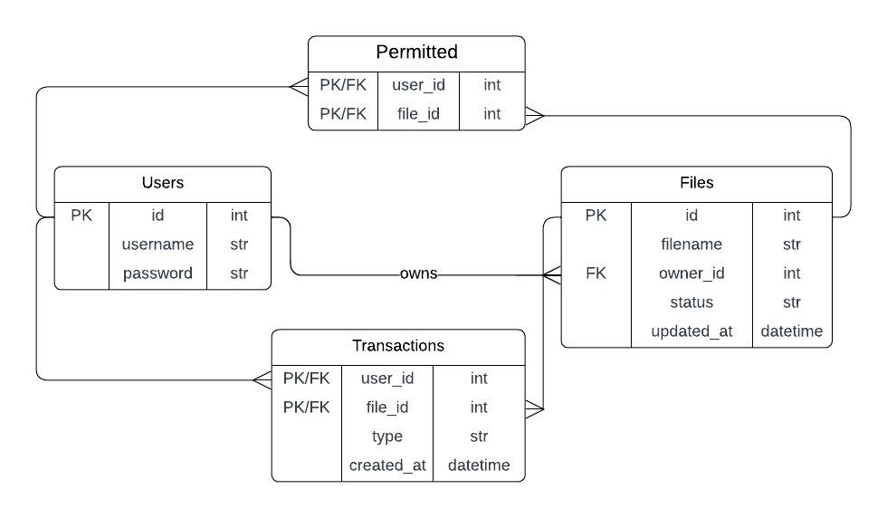

# Cryptic
A web application that allows users to manage their confidential files.

## Table of Content
- [Features](#features)
- [ERD Diagram](#erd-diagram)
- [Tech Stack](#tech-stack)
- [Setup](#setup)

## Features
- Users can encrypt and decrypt their files.
- Users can request to delete the encrypted file from the server after downloading it.
- Only the owner of the file can decrypt it unless he permitted other users to do so.

## ERD Diagram

## Tech Stack
- Python
- Django
- Django REST Framework
- SQLite

## Setup
#### 1. Clone the repo
```bash
git clone https://github.com/hazemessam/cryptic.git
```

#### 2. Move to the project directory
```bash
cd cryptic
```

#### 3. Create a virtual environment
```bash
python3 -m venv venv
```

#### 4. Activate the virtual environment
```bash
source venv/bin/activate
```

#### 5. Install the dependances
```bash
pip3 install -r requirements.txt
```

#### 6. Migrate the database
```bash
python3 manage.py migrate
```

#### 7. Run the project
```bash
python3 manage.py runserver
```

#### 7. Now check http://localhost:8000
